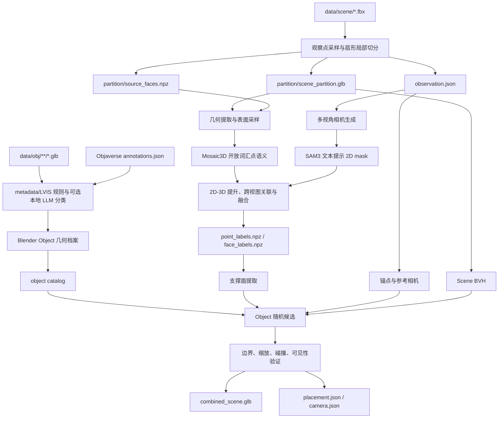

# SceneCompose 技术实现细节

本文档描述当前仓库中已经落地的三阶段 Inline Execution 流程：观察点驱动的 Scene 切分、Scene 语义/实例分割、Scene 与 Objaverse Object 组合。内容以代码实际行为为准，不把配置中尚未接入求解器的字段描述为已实现功能。

## 1. 总体数据流



三阶段通过文件衔接，不在同一进程中长期持有大 Scene、Mosaic3D、SAM3、LLM 和 Blender 状态。这样可以独立恢复失败阶段，也便于在服务器上按 CPU、GPU 和显存需求分别调度。

## 2. 坐标、单位与确定性

所有 Scene 几何使用 Blender 评估后的世界坐标。对象实例变换和 modifier 在几何提取时生效。当前默认约定 `Z` 为上方向。

- `configs/observation_partition.json` 中 `meters_per_blender_unit` 默认为 `null`，此时沿用 FBX/Blender Scene 的单位设置。
- `configs/segmentation.json` 不会根据 Scene 包围盒猜测实际比例。
- Object 的目标尺寸以米配置，因此输入 Scene 与 Object 的单位语义必须正确；如果 FBX 单位错误，应显式配置换算，而不是依赖包围盒猜测。
- 切分随机数由固定 seed 和 Scene SHA-256 派生；组合随机数由固定 seed 和 observation ID 的稳定摘要派生。
- `observation_id` 由源 Scene 摘要、锚点、参考方向、半径、视角和配置摘要生成。相同输入和配置应得到相同 ID。

## 3. 第一阶段：观察点驱动的 Scene 切分

### 3.1 入口

单 Scene：

```bash
scenecompose sample-observations \
  --scene data/scene/example.fbx \
  --output data/work/example/observations \
  --config configs/observation_partition.json \
  --blender "$SCENECOMPOSE_BLENDER"
```

批量 Scene：

```bash
scenecompose sample-observations-all \
  --scene-root data/scene \
  --output-root data/work \
  --workers 4
```

Python 调度层位于 `src/scenecompose/observation/pipeline.py`，Blender 内执行的几何算法位于 `scripts/blender/sample_observation_partitions.py`。批量入口当前递归发现 FBX，并为每个 Scene 启动独立的后台 Blender 进程。

### 3.2 Scene 导入与几何展开

Blender 以 `--background --factory-startup` 启动并导入 FBX。程序遍历 Scene 中所有 mesh 和实例，读取 evaluated depsgraph：

1. 应用对象世界变换、实例变换和 modifier。
2. 将 polygon 三角化为 loop triangles。
3. 为每个三角形计算世界坐标顶点、质心、法向和面积。
4. 保存源 object、instance、polygon 和 object 内三角形编号，为后续回溯建立基础。

这里不要求原 Scene 是多个语义对象。即使扫描 Scene 的全部内容融合为单一 mesh，也能按三角形处理。

为了避免每个 observation 重复执行 `evaluated.to_mesh()`，上述数据在 FBX 导入后一次性缓存为 `SourceGeometry`。世界坐标、法向、面积和 UV 使用 `float32`，三角形、loop、polygon 索引使用 `int32`。地面发现、锚点采样和所有 observation 共享该缓存。运行日志会输出 source 数、三角形数、缓存大小和构建耗时。

### 3.3 候选地面发现

候选地面首先满足：

```text
normal.z >= cos(floor_max_slope_deg)
triangle_area > 0
```

默认最大坡度为 15 度。候选三角形质心随后量化到三维网格：

```text
cell_x = floor(x / floor_component_cell_m)
cell_y = floor(y / floor_component_cell_m)
cell_z = floor(z / floor_height_band_m)
```

程序对相邻 3x3x3 cell 做 flood fill，并限制相邻高度差。累计面积小于 `min_floor_component_area_m2` 的连通区域会被丢弃。该步骤是纯几何地面候选，不依赖语义分割，所以可以作为整个 pipeline 的第一步。

### 3.4 观察锚点采样

程序按三角形面积加权选择地面三角形，再用重心坐标在三角形内部均匀采样锚点。每个锚点必须通过以下验证：

1. 向上射线在 `min_head_clearance_m` 范围内无碰撞。
2. 在多个身体高度上发射一圈水平射线，保证 `min_body_clearance_radius_m` 内没有墙、家具或其他障碍。
3. 在锚点周围向下发射射线，检查脚下地面连续，避免采到悬空边缘或孔洞。
4. 与已接受锚点的 XY 距离不小于 `min_anchor_spacing_m`。

最多执行 `observations_per_scene * anchor_attempts_per_output` 次尝试。无法找到足够锚点时允许少于配置数量，不会复制低质量观察点。

### 3.5 参考观察方向

对一个有效锚点随机生成 `direction_trials` 个水平朝向。每个方向定义一个半径为 `radius_m`、水平张角为 `horizontal_angle_deg`、垂直范围为 `[anchor_z - vertical_below_anchor_m, anchor_z + vertical_above_anchor_m]` 的扇形柱体。

对三角形质心执行包含测试，并以：

```text
score = (扇形内三角形数量, 扇形内三角形面积)
```

作字典序最大化。核心三角形数少于 `minimum_core_triangles` 时拒绝该方向。最终得到正交参考系：

- `up = (0, 0, 1)`；
- `reference_forward` 为选中的水平观察方向；
- `reference_right` 为 forward 与 up 构成的右向量；
- `anchor_eye = anchor_floor + observer_height_m * up`。

### 3.6 Core 与 Context 几何选择

Core 是严格的观察扇形。Context 在 Core 基础上增加：

```text
expansion = camera_motion_radius_m + context_margin_m
context_radius = radius_m + expansion
context_half_angle = core_half_angle + atan2(expansion, radius_m)
```

并上下扩展 `context_margin_m`。三角形是否进入输出不是只看质心，而是检查质心、顶点和边中点等采样位置是否落入 Context，从而避免边界处的大三角形被突然裁掉。实现会依次检查质心、三个顶点和三个边中点，并累计同一个 Context mask，不再构造 `[triangle_count, 7, 3]` 的大型临时数组。输出保留完整三角形，不会切开一个三角形。

一个 observation 命中的所有 source 会合并为单个 `partition_merged` mesh。合并时重新建立顶点索引、三角形顺序、UV loop 和 source provenance。不同 source 出现过的活动 UV layer 名都会保留，每层在对应面上写入该 source 的活动 UV，以兼容隐式和显式命名的纹理查询。输出只挂载选中 polygon 实际使用的材质；正常材质直接复用，只有包含零尺寸 Image Texture 的材质才创建私有副本、移除无效节点并记录到日志。有效纹理和 UV 保持不变。

遮挡不用于删除几何。被墙遮挡的 Context 几何仍保留在 partition 中，后续 RGB/depth 渲染负责产生真实可见性，组合阶段再对最终 Object 执行射线检查。

### 3.7 第一阶段产物

```text
data/work/<scene-id>/observations/
|-- observations.json
|-- summary.json
`-- observation_<hash>/
    |-- observation.json
    `-- partition/
        |-- scene_partition.glb
        `-- source_faces.npz
```

`observation.json` 保存锚点、参考坐标系、扇形范围、Context 参数和相对产物路径。`source_faces.npz` 为每个导出三角形保存：

- 输出 object 名和 object 内三角形编号；
- 源 object、instance 和 polygon 编号；
- `is_core` 与 `is_context`。

GLB 重新导入后可能改变对象枚举顺序，因此后续通过“对象名 + 对象内三角形编号”恢复映射，而不是依赖导入顺序。当前优化实现的对象名固定为 `partition_merged`，object 内三角形编号与合并 mesh 的 polygon/triangle 写入顺序一致。

### 3.8 Legacy XY 切分

`partition` 和 `partition-all` 命令仍保留，但不是当前默认 pipeline。Legacy 实现按 Scene 复杂度和 XY 空间中位数递归切块，主要用于旧产物和调试。当前语义分割与组合应消费 observation partition。

## 4. 第二阶段：Scene 语义与实例分割

### 4.1 方法组成

当前实现不是将三篇论文代码直接拼成单个网络，而是采用三类能力的工程融合：

- Mosaic3D：在 3D 表面采样点上生成开放词汇特征和语义候选。
- SAM3：在 observation 的多视角 RGB 上执行类别文本提示分割。
- Open3DIS 风格处理：利用相机和深度将 2D mask 提升到 3D，并通过几何重叠、空间距离和 3D 特征执行跨视图实例关联。

统一词表由 `configs/segmentation.json` 的 `vocabulary` 定义。每个类别具有固定 ID、名称、同义词和 `thing/stuff` 类型。Mosaic3D 与 SAM3 必须使用同一词表，融合阶段不接受模型各自的临时类别编号。

### 4.2 六阶段执行图

每个 observation 顺序执行：

```text
geometry -> views -> mosaic3d -> sam3 -> fusion -> export
```

状态写入 `segmentation/manifest.json`。每一阶段记录：

- 当前状态：`pending/running/complete/failed`；
- 本阶段配置摘要；
- 上游 artifact 摘要；
- 外部 checkpoint 或 observation 文件指纹；
- 日志和输出 artifact 摘要。

启用 `--resume` 时，配置摘要、上游摘要和外部输入都匹配才会复用。`--force-stage sam3` 会使 SAM3 及其后的 fusion、export 失效，但保留 geometry、views 和 Mosaic3D。

### 4.3 Geometry：几何与表面点采样

Blender 重新导入 `scene_partition.glb`，再次从 evaluated mesh 提取世界坐标三角形，并生成：

- `geometry/geometry.npz`：顶点、三角形、材质/纹理颜色、object 和 polygon 映射。
- `geometry/samples.npz`：按三角形面积进行表面采样的点、颜色、法向、triangle ID 和重心坐标。
- `geometry/observation_mapping.npz`：重新导入三角形到第一阶段 `source_faces.npz` 的映射，以及 `is_core/is_context`。
- `geometry/sampled_points.ply`：人工检查点云。

采样点数默认最多 500,000。纹理颜色优先通过 UV 在三角形角点采样；无法获得纹理时退回材质颜色，再退回 `neutral_rgb`。

### 4.4 Views：锚点相对多视角渲染

对 observation 分割时，相机不在整个 Scene 包围盒外环绕，而是以 `anchor_eye` 为中心，在 `reference_forward/reference_right` 坐标系内移动：

1. 候选位置包括锚点以及 `camera_motion_radius_m` 的 0.45、0.85 倍半径上的四个主方向。
2. 每个位置先执行 `camera_min_clearance_m` 碰撞净空检查。
3. 对有效位置组合配置的 yaw 和 pitch 偏移。
4. 达到 `observation_camera_count` 后停止，默认最多生成 24 个 observation 相机。

Blender EEVEE 输出：

- `views/rgb/view_*.png`；
- `views/depth/view_*_*.exr`，32 位浮点 Z pass；
- `views/cameras/view_*.json`，包含相机内参、`camera_to_world`、`world_to_camera` 和锚点偏移；
- `views/views.json`。

Blender 相机局部观察方向为 `-Z`，局部向上为 `+Y`。像素原点在左上角，反投影使用像素中心 `(column + 0.5, row + 0.5)`。

### 4.5 Mosaic3D：开放词汇点语义

`Mosaic3DAdapter` 强制设置 Hugging Face 和 Transformers 离线模式，从本地仓库和 checkpoint 加载网络。表面点先按 `voxel_size_m` 体素化：

1. 坐标减去体素点均值进行中心化。
2. RGB 映射到 `[-1, 1]` 作为输入特征。
3. 使用配置中的 condition（默认 ScanNet）执行稀疏卷积网络。
4. 将体素特征归一化并通过 inverse map 恢复到采样点。
5. 对词表中类别名和同义词分别编码、平均、再次归一化，形成类别文本特征。
6. 点特征与文本特征点积后 softmax，保留 top-k 类别。

若 top-1 置信度低于 `unknown_confidence`，或 top-1/top-2 margin 低于 `unknown_margin`，该点标为 unknown。输出为：

- `mosaic3d/point_features.pt`；
- `mosaic3d/semantic_scores.npz`。

当前代码在采样点数超过 `chunk_points` 时直接失败并提示降低 `geometry.sample_count`，尚未执行滑窗 chunk；`chunk_overlap_m` 目前没有进入推理逻辑。

### 4.6 SAM3：多视角文本提示 mask

SAM3 同样在离线模式下从本地 checkpoint 构建。对每张 RGB：

1. 设置当前图像状态。
2. 对词表中每个类别名和同义词逐个设置 text prompt。
3. 读取 mask、score 和 XYXY box。
4. 丢弃面积小于 `min_mask_area_px` 的 mask。
5. 丢弃边界占比超过 `max_border_fraction` 的大面积贴边 mask。
6. 将二值 mask 编码为 column-major uncompressed RLE。

结果写入 `sam3/masks.json`。当前 adapter 按图像和 prompt 顺序执行，`image_batch_size` 尚未用于批量图像推理。

### 4.7 2D mask 提升到 3D

对一个 SAM3 mask，程序读取同一 view 的深度和相机矩阵。mask 内有效像素反投影为相机局部射线：

```text
ray = normalize(((u + 0.5 - cx) / fx,
                 -(v + 0.5 - cy) / fy,
                 -1))
point_camera = ray * depth
point_world = camera_to_world * point_camera
```

随后用 `cKDTree` 查找最近的 Scene 表面采样点，只接受距离不超过 `lift_radius_m` 的匹配。重复命中同一采样点时保留最大的高斯距离权重：

```text
weight = exp(-(distance / lift_radius_m)^2)
```

一个提升后的 observation 包含 mask ID、view ID、类别、SAM3 score、3D 点集合、点权重和质心。

### 4.8 跨视图实例关联

提升后的 mask observation 按质心量化到 `association_grid_m` 空间网格。只比较相同类别、不同 view、位于当前或相邻 26 个网格 cell 的候选。关联分数为：

```text
association_score = 0.55 * point_IoU
                  + 0.20 * centroid_distance_score
                  + 0.25 * Mosaic3D_feature_cosine
```

分数达到 `association_threshold` 时通过 union-find 合并。合并后的实例至少需要 `min_instance_points` 个点和 `min_instance_views` 个观察视图。

### 4.9 语义与实例融合

Mosaic3D top-1 首先作为基础点语义。对于一个已关联的 SAM3 实例，融合置信度为：

```text
fused_score = mosaic_weight * mosaic_score
            + sam3_weight * sam3_score
            + view_weight * view_score
            + visibility_weight * size_score
```

默认权重分别为 0.45、0.35、0.10、0.10。只有 `fused_score` 高于某点当前语义置信度时才覆盖该点。`thing` 类实例按置信度从高到低竞争未占用点，防止两个实例重复占据同一采样点。

点标签通过 triangle ID 投票到面：

- 某语义在一个面的采样点比例达到 `face_semantic_vote` 才赋予面语义。
- 某实例在一个面的采样点比例达到 `face_instance_vote` 才赋予面实例。
- 点可见次数由所有 depth view 反投影后统计；面可见次数取该面采样点的最大值。
- `is_core` 由第一阶段三角形映射传递，不由分割模型预测。

### 4.10 第二阶段产物

关键输出：

```text
<observation>/segmentation/
|-- manifest.json
|-- geometry/
|-- views/
|-- mosaic3d/
|-- sam3/
|-- fusion/
|   |-- point_labels.npz
|   |-- face_labels.npz
|   |-- fused_instances.npz
|   `-- instances.json
`-- visualization/
    |-- semantic.ply
    `-- instances.ply
```

组合阶段直接依赖 `geometry/geometry.npz` 与 `fusion/face_labels.npz`；它不会重新调用 Mosaic3D、SAM3 或 LLM。

### 4.11 八卡调度

`segment-observations` 使用 `ProcessPoolExecutor` 将 observation 按顺序轮询分配到 GPU ID：

```text
gpu = selected_gpus[index % number_of_gpus]
```

每个 worker 设置自己的 `CUDA_VISIBLE_DEVICES`，worker 内模型统一使用 `cuda:0`，这里的 `cuda:0` 指该进程可见的第一张物理 GPU。因此在 8 卡服务器上可使用 `--gpus 0,1,2,3,4,5,6,7 --workers 8`。

## 5. 第三阶段：Scene 与 Object 组合

第三阶段分为一次性的 Object catalog 构建和可重复执行的 observation 组合。LLM 只参与 Object 语义分类，不决定坐标、旋转、缩放或碰撞结果。

### 5.1 Objaverse Object 发现与 metadata 关联

`discover_objects` 递归扫描 `data/obj` 下的 `.glb`，忽略 `metadata`、`cache`、`work`、`.cache` 和 `weights` 目录。GLB 文件名 stem 作为 Objaverse UID。

每个 UID 必须存在于 `annotations.json`，并通过 `_scenecompose.uid` 和 `_scenecompose.glb_relative_path` 校验。重复 UID、metadata 路径冲突会直接失败，缺少 annotation 的 GLB 当前会被跳过。

### 5.2 规则分类

规则分类按以下顺序执行：

1. 许可证必须位于 `allowed_licenses`。
2. metadata category 不得命中建筑、角色、车辆等拒绝列表。
3. GLB metadata face count 必须位于配置范围。
4. LVIS 类别、名称、tag 和 metadata category 统一小写、去标点并分词。
5. 与 `class_rules` 的 terms 匹配。

唯一类别命中时直接接受；LVIS 精确命中置信度为 0.98，其他 metadata 命中为 0.90。多类别冲突或无规则命中变为 `needs_review`。分类结果同时确定：

- `canonical_class`；
- `placement_type`，当前为 `surface` 或 `floor`；
- 允许的 `support_classes`；
- 目标尺寸维度 `height/longest`；
- 合理尺寸区间。

### 5.3 可选本地 LLM 分类

当 `llm.enabled=true` 时，仅将规则无法确定的 Object 交给本地 Transformers 模型。模型通过 `AutoTokenizer` 和 `AutoModelForCausalLM` 从 `model_path` 离线加载到指定 device，不使用 HTTP 或外部 API。

Prompt 提供标准类别集合和 Objaverse metadata，要求返回 JSON：

```json
{
  "decision": "accepted",
  "canonical_class": "cup",
  "confidence": 0.92,
  "reason": "..."
}
```

代码请求 `enable_thinking=false`，并附加 `/no_think`。输出必须满足：类别位于配置白名单、decision 合法、confidence 达到阈值。LLM 无权新增类别或更改类别的支撑关系和尺寸规则。

缓存 `llm_classification_cache.json` 带完整 composition config digest。修改模型路径、类别规则或相关配置后旧缓存自动失效。模型在一次 catalog 进程中只加载一次。

### 5.4 Blender Object 几何档案

规则或 LLM 接受的 GLB 被分批交给 `profile_objaverse_batch.py`。每个 Object 独立执行：

1. 清空 Blender Scene 和未使用数据块。
2. 导入 GLB 并读取 evaluated mesh。
3. 统计 mesh 数与真实三角形数。
4. 计算世界空间 AABB 和 extent。
5. 记录 `+X/-X/+Y/-Y/+Z/-Z` 六种 up-axis 对应的包围盒尺寸与简单高宽启发分数。

损坏 Object 会生成 `status=failed` 的 profile，不中断同一 Blender batch 中其他 Object。Python 调度层按 `catalog.workers` 并发启动 Blender batch。最终 `catalog.json` 保存 Object 路径、文件签名、分类和 profile 路径。

### 5.5 支撑面提取

对每个已完成分割的 observation，`support.py` 同时读取：

- `segmentation/geometry/geometry.npz`；
- `segmentation/fusion/face_labels.npz`；
- `configs/segmentation.json` 的 semantic ID 到名称映射。

候选面必须同时满足：

```text
semantic_class in allowed_support_classes
is_observed == true
is_core == true
visibility_count >= minimum_visible_views
normal.z >= cos(maximum_slope_deg)
triangle_area > 0
```

候选面先按 `semantic_id + instance_id` 分组，再以共享顶点 union-find 拆成真正连通的 patch。面积小于 `minimum_patch_area_m2` 的 patch 被丢弃。

每个 patch 记录语义、实例、面积、质心、AABB、加权平均法向和候选点。候选点选自大面积三角形的质心。为处理凹形桌面和带孔平面，程序统计只出现一次的三角形边作为 patch 边界，并计算每个候选点到所有 XY 边界线段的最短距离 `boundary_clearance_m`。

### 5.6 observation 与 Object 匹配

组合调度层只保留：

- 分类为 accepted；
- profile 完成；
- 真实三角形数和 mesh 数在配置范围内；
- Object 的 `support_classes` 与 observation 实际支撑面语义有交集。

兼容 Object 使用 observation 派生的固定随机 seed 打乱，最多向 Blender 提交 `max_object_trials` 个 Object。输出目录镜像 observation 相对于 `observation_root` 的路径，避免不同 Scene 中同名 observation 冲突。

### 5.7 Blender 放置候选生成

Blender 首先导入 `scene_partition.glb` 并为所有 evaluated Scene mesh 构建一个世界坐标 BVH。对候选 Object：

1. 导入 GLB，保留其多 mesh/父子结构。
2. 当前将 `+Z` 作为首选 up-axis；profile 中其他五个方向已记录，但当前求解器尚未逐一尝试。
3. 在兼容 support patch 中随机打乱候选点。
4. 每个点最多尝试 `yaw_trials` 个 `[−pi, pi]` 随机 yaw。
5. 在类别目标尺寸区间随机采样目标尺寸。
6. 仅执行 uniform scale：`scale = target_size / current_dimension`。
7. 将 Object XY AABB 中心对齐候选点，将底部抬到支撑点 Z 加 `minimum_clearance_m`。

若类别的 `target_dimension=height`，以旋转后 AABB 高度归一化；若为 `longest`，以最长 AABB 边归一化。缩放必须位于 `minimum_scale_factor` 与 `maximum_scale_factor` 之间。

### 5.8 几何验证

候选按以下顺序验证：

1. **支撑 AABB**：Object XY AABB 必须位于 support patch XY AABB 内。
2. **真实边界净空**：用 Object XY AABB 的半对角线作为保守底面半径：

   ```text
   required_clearance = 0.5 * sqrt(width^2 + depth^2) + boundary_margin_m
   ```

   要求候选点的 `boundary_clearance_m >= required_clearance`。这是一个保守的圆形包络测试，可避免跨出凹形边界或落入孔洞，但可能拒绝本可容纳的细长 Object。
3. **BVH 碰撞**：为 Object evaluated mesh 建立 BVH，与切分 Scene BVH 执行 triangle overlap。Object 已先抬高最小净空，因此正常接触面不应被视为穿透。
4. **锚点可见性**：从 `anchor_eye` 向 Object AABB 中心发射一条射线。如果 Scene 在到达 Object 中心前产生 hit，则拒绝。

验证失败时删除本次导入的 Object，记录 Object UID、support patch ID 和失败原因，然后继续下一候选。第一个完全通过的候选即被接受。

### 5.9 第三阶段产物

成功任务输出：

```text
data/composed/<observation-relative-path>/
|-- combined_scene.glb
|-- placement.json
|-- camera.json
`-- support_patches.json
```

- `combined_scene.glb`：当前 partition Scene 与放置后的 Object，一并由 Blender 导出。
- `placement.json`：Object UID、标准类别、support、位置、yaw、up-axis、uniform scale、AABB 和先前失败尝试。
- `camera.json`：以 observation `anchor_eye` 为参考位置、Object AABB 中心为 look-at 的相机建议以及水平 FOV。
- `support_patches.json`：支撑面的几何与候选点。

本阶段不执行图片渲染。`camera.json` 只是后续渲染阶段的输入参考，相机可以在观察点基础上继续移动。

任务没有可行候选时仍写入 `placement.json`，其 `status=failed`，并让对应 Blender 进程返回非零状态。批量 summary 汇总失败数量。

## 6. 当前已实现约束与保留配置

为避免误解，下表区分配置文件中的字段与当前代码是否真正使用。

| 能力 | 当前状态 | 说明 |
|---|---|---|
| 观察扇形半径、角度、垂直范围 | 已实现 | 用于 Core/Context 三角形选择 |
| 观察者头部、身体、脚下净空 | 已实现 | Blender ray cast |
| Mosaic3D top-k 与 unknown 阈值 | 已实现 | 点语义基础结果 |
| SAM3 mask 面积与边界过滤 | 已实现 | 每张图、每个 prompt 顺序推理 |
| 跨视图几何/特征实例关联 | 已实现 | 网格邻域、IoU、距离、特征余弦 |
| Core 与可见性约束支撑面 | 已实现 | `is_core/is_observed/visibility_count` |
| 支撑面真实边界净空 | 已实现 | 保守圆形包络 |
| uniform scale 范围 | 已实现 | 非均匀缩放明确禁止 |
| Scene/Object triangle BVH overlap | 已实现 | 使用完整 evaluated triangle，不使用简化碰撞 mesh |
| 最终相机多点可见比例 | 未实现 | 当前只有 anchor 到 Object AABB 中心的一条射线 |
| Object 六方向自动 upright 选择 | 未实现 | 当前优先并实际使用 `+Z` |
| 物理稳定性/重心投影 | 未实现 | 当前边界圆包络不等价于质量稳定性 |
| `minimum_support_coverage` | 未直接使用 | 当前边界圆包络要求更保守的完全容纳 |
| `maximum_penetration_m` | 未直接使用 | 当前 BVH 只做是否 overlap 的二值判断 |
| `collision_decimation_faces` | 未使用 | 当前碰撞使用完整网格 |
| `plane_height_tolerance_m` / `adjacency_tolerance_m` | 未使用 | 当前支撑 patch 只按语义、实例和共享顶点连通 |
| `occupancy_cell_m` | 未使用 | 当前没有构建支撑面栅格，使用三角形边界净空 |
| `minimum_primary_component_ratio` | 未使用 | profile 当前统计 mesh 数，没有计算 Object 顶点连通分量比例 |
| `minimum_footprint_ratio` / `bottom_band_ratio` | 未使用 | 当前 footprint 来自整个 Object 的 XY AABB |
| `minimum_camera_visible_ratio` / `object_visibility_samples` | 未使用 | 当前只有中心射线二值可见性 |
| LLM `max_retries` | 未使用 | 当前每批只生成一次，非法 JSON 直接变为 `needs_review` |
| Fusion `depth_tolerance_m` | 未使用 | 当前 2D-3D 匹配只使用 `lift_radius_m` |
| Mosaic3D chunk overlap | 未实现 | 超过 `chunk_points` 会失败 |
| SAM3 image batch | 未实现 | `image_batch_size` 暂未进入 adapter |
| 图片渲染 | 未实现 | 只输出组合 GLB 与参考 camera JSON |
| observation 间共享纹理 | 未实现 | 每个 GLB 仍是自包含文件，同一有效纹理可能被重复编码 |

## 7. 推荐的运行顺序

```bash
# 1. 观察点切分
bash scripts/run_observation_partition_all.sh data/scene data/work 4

# 2. 八卡分割
bash scripts/run_observation_segmentation.sh \
  data/work 0,1,2,3,4,5,6,7 8

# 3. Object catalog；规则默认启用，LLM 默认关闭
bash scripts/run_object_catalog.sh \
  data/obj \
  data/obj/metadata/annotations.json \
  data/work/object_catalog

# 4. 组合；不渲染
bash scripts/run_composition.sh \
  data/work \
  data/work/object_catalog/catalog.json \
  data/composed
```

在正式计算前，可以分别使用 `segment-observations --dry-run`、`build-object-catalog --dry-run` 和 `compose-observations --dry-run` 检查发现路径与任务数量。注意 composition 的 dry-run 当前仍会提取并写出 `support_patches.json`，因为支撑面发现本身用于确定可组合任务。

## 8. 关键代码位置

| 模块 | 路径 |
|---|---|
| 切分调度 | `src/scenecompose/observation/pipeline.py` |
| 观察点与扇形切分 | `scripts/blender/sample_observation_partitions.py` |
| 分割调度与恢复 | `src/scenecompose/segmentation/pipeline.py` |
| Blender 几何和视图 | `scripts/blender/prepare_segmentation_scene.py` |
| Mosaic3D adapter | `src/scenecompose/segmentation/mosaic.py` |
| SAM3 adapter | `src/scenecompose/segmentation/sam3_adapter.py` |
| 2D-3D 提升 | `src/scenecompose/segmentation/lifting.py` |
| 跨视图关联 | `src/scenecompose/segmentation/association.py` |
| 点/面融合 | `src/scenecompose/segmentation/fusion.py` |
| Object catalog | `src/scenecompose/composition/catalog.py` |
| metadata 规则 | `src/scenecompose/composition/rules.py` |
| 本地 LLM | `src/scenecompose/composition/llm.py` |
| 支撑面提取 | `src/scenecompose/composition/support.py` |
| 组合调度 | `src/scenecompose/composition/pipeline.py` |
| Blender 放置与 GLB 导出 | `scripts/blender/compose_observation.py` |

## 9. 后续优先改进

建议后续按以下顺序增强，而不是首先增加更多 LLM 推理：

1. 使用 Objaverse 缩略图或多视角渲染估计 Object upright 和正面方向，并实际遍历六个 axis 候选。
2. 将单中心射线升级为 Object 表面多点可见率，同时在 observation 相机移动域中搜索最终相机。
3. 加入底部接触点、重心投影、倾覆裕量和容许穿透深度，形成真正的稳定性检查。
4. 用二维 footprint polygon 与 support polygon 做覆盖率计算，替换当前保守圆包络。
5. 为 Mosaic3D 实现带 halo 的空间 chunk 和重叠区融合，以支持更大的 observation。
6. 将 composition 调度改为多 Blender worker，并为每个 observation 建立可恢复 manifest。

这些改进主要属于几何和调度问题。LLM 应继续只负责语义兼容性，不应直接输出未经几何验证的放置坐标。
